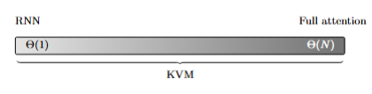
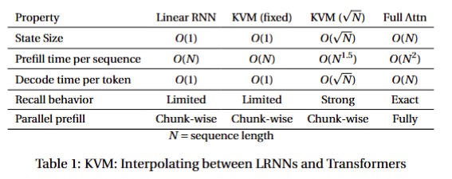
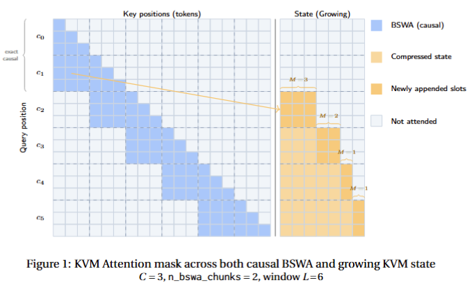

# Key-Value Means 
##  Transformers with Expandable Block-Recurrent Compressed Memory

Paper link: https://arxiv.org/abs/FIXME

Checkpoints: https://huggingface.co/collections/recursal/key-value-means

Key-Value Means ("KVM") is a novel block-recurrence for attention that that can accommodate either fixed-size or growing state. This limits the KV Cache size to whatever size you think is appropriate for your application, even as the context grows. It performs competitively on long-context tests with only subquadratic prefill time and sublinear state growth.

<div align="center" >
     
</div>

KVM allows you to choose where you want to be on a scale between LRNNs and full attention time complexity and memory usage.

<div align="center" >
     
</div>

It accomplishes this by maintaining both a Block Sliding Window of Attention as well as a growable state, both of which are attended to at once.

<div align="center" >
     
</div>

Please see the Key-Value Means paper at https://arxiv.org/abs/FIXME for more details.

## What's included in this repository

- Reconfigurable Transformer base model code with support for carried state
- GPTAlpha2 backbone and model
- Pluggable time mixer component classes for several model architectures
  - Key-Value Means ("KVM")
  - Online Vector Quantization ("OVQ")
  - RWKV-7
  - Block Sliding Window Attention
  - Sliding Window Attention
- HuggingFace transformers conversion scripts and model code
- simple config system
- Fast custom trainer
- lm_eval_harness support
- inference support

## setup

Please use the provided script at `scripts/install.sh`

## configuration

Config system allows you to specify one or more `-c CONFIG_PATH` in yaml or json format
Later configs will override earlier ones
You can also list specific config parameters e.g. `--model.num_hidden_layers 12 --train.batch_size 8`

See configuration classes extending pydantic BaseModel in `train.py` and `model/rwkv7_backbone.py` for specific configuration settings.

## running it

Example training scripts are provided in `scripts/training_runs.sh` This directory also includes the scripts used to run the evals in the paper.


## Citation

If you use this code or find our work valuable, please consider citing Key-Value Means:

```bibtex
FIXME
```
